# Orchestration Flow Diagrams

Centralized workflow diagrams for the `copilot-app` orchestration skills. This keeps the
individual `SKILL.md` files focused on execution rules while preserving one reviewable
overview of stage order, approval gates, and PR handoff points.

## orch-repo

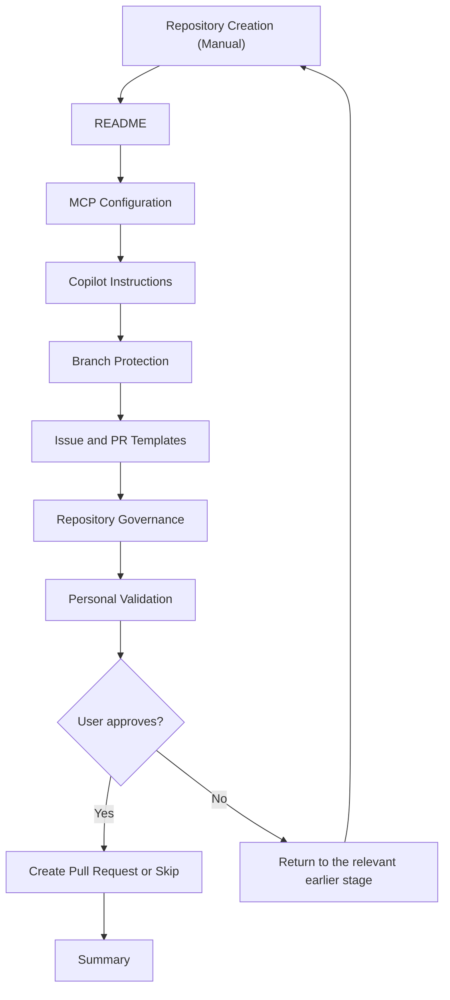

## orch-project

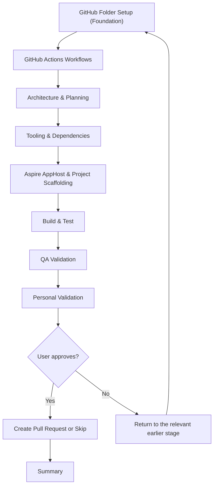

## orch-create-mvp

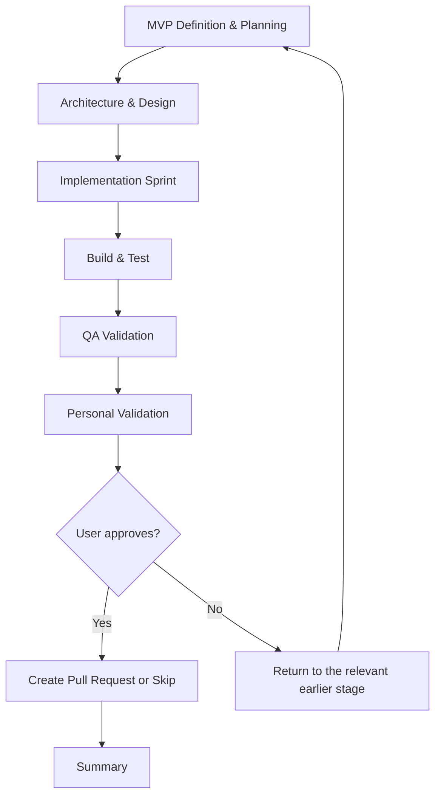

## orch-update-packages

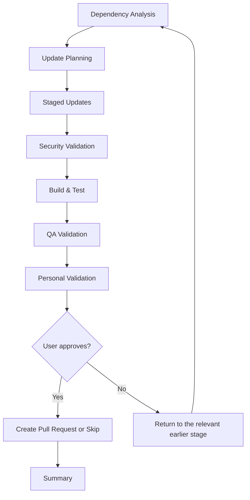

## orch-aspire-update

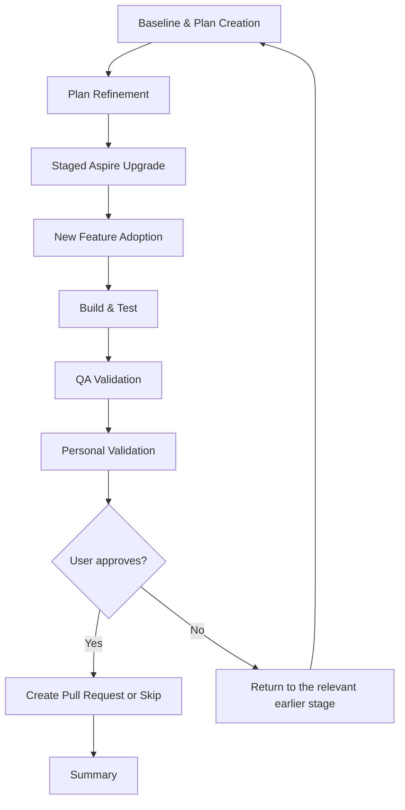

## orch-architecture

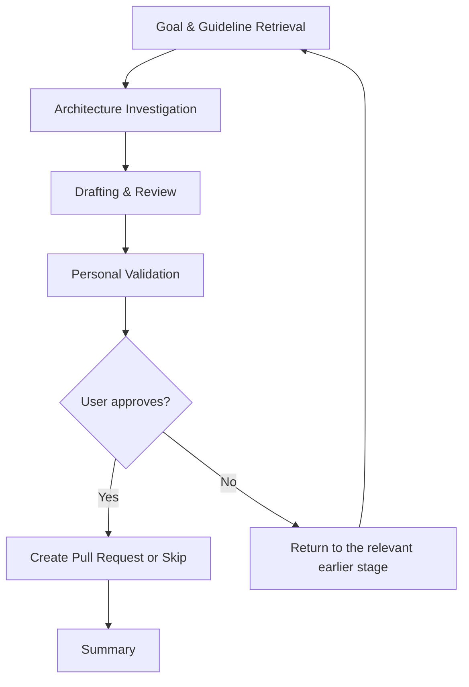

## orch-arc42

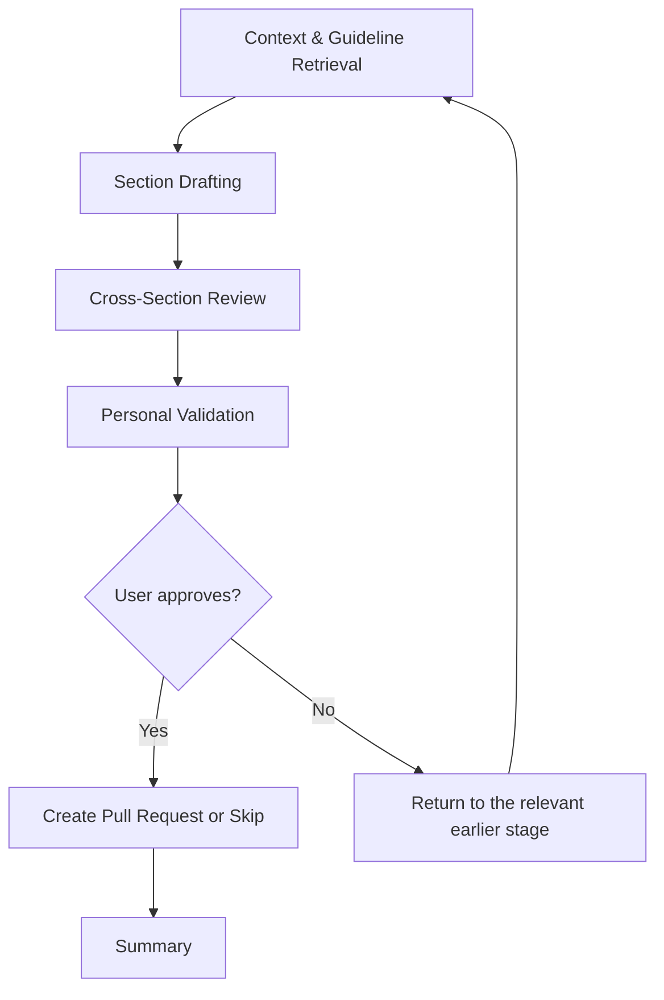

## orch-blueprint

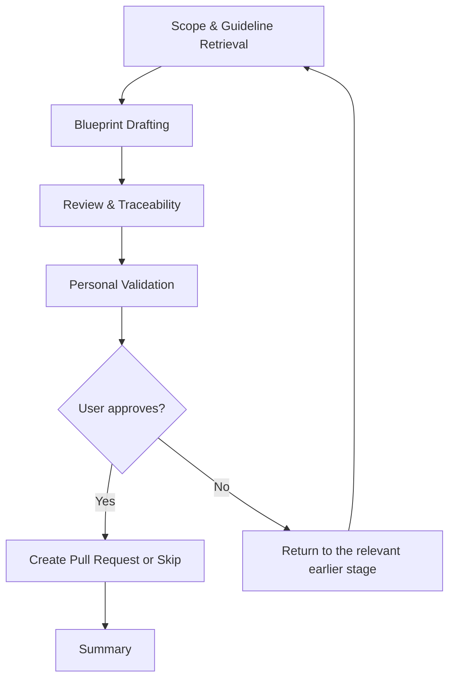

## orch-adr

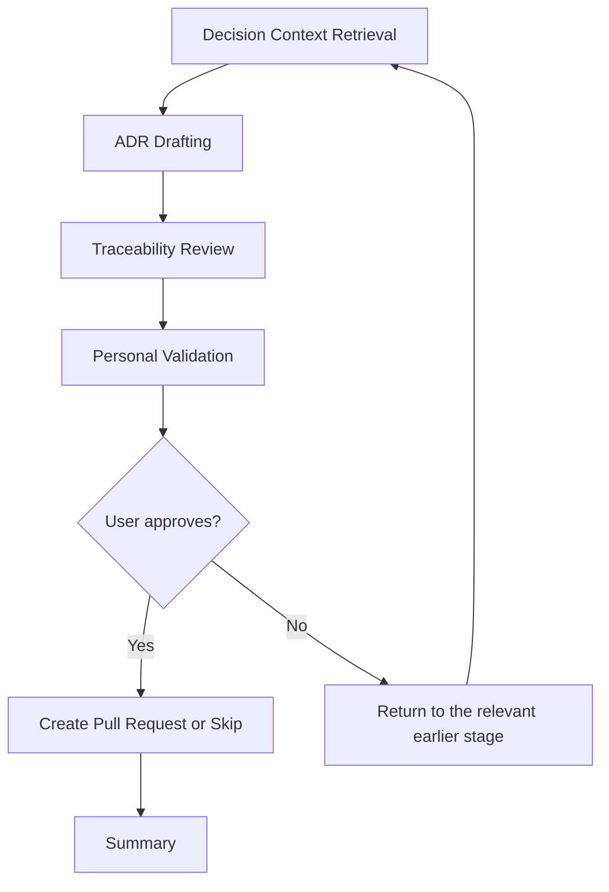

## orch-tdr

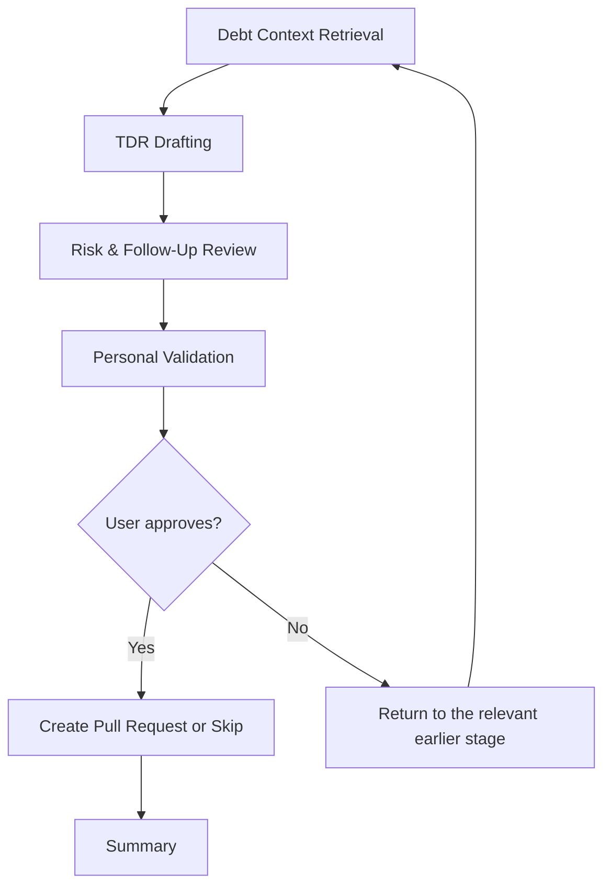

## orch-feature

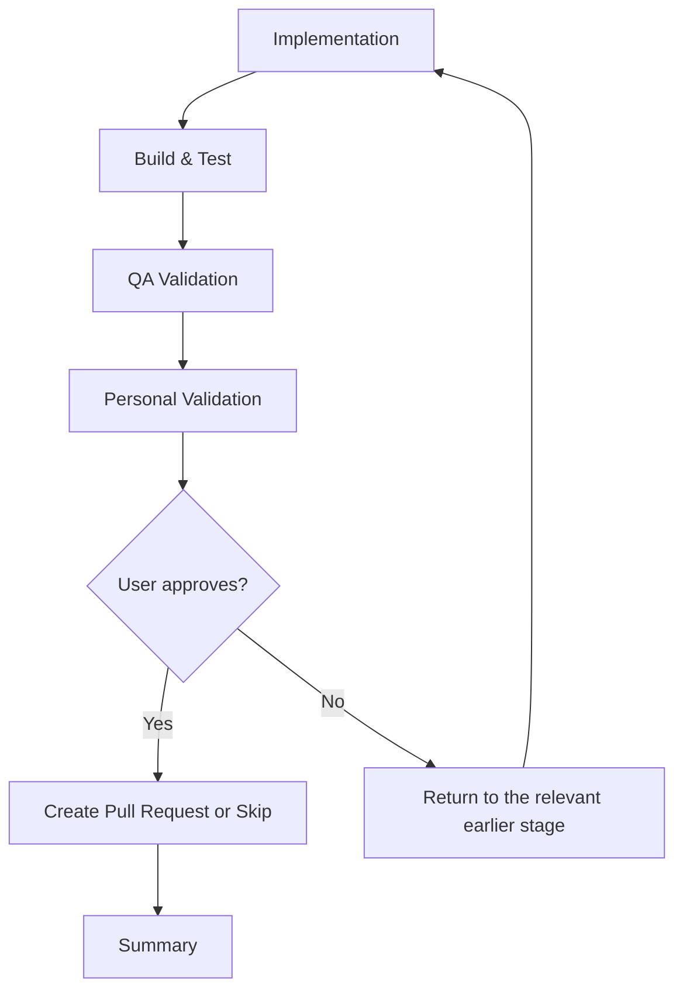

## orch-bug

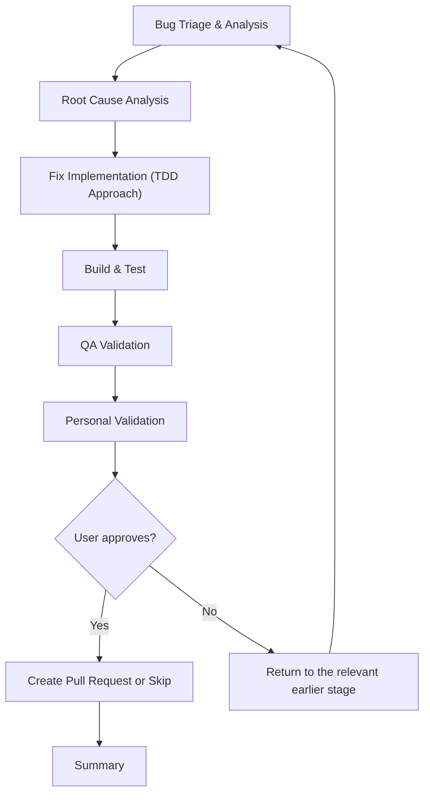

## orch-create-module

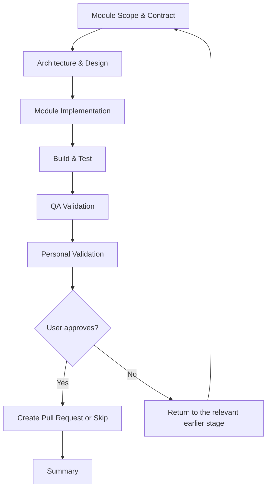

## orch-create-service

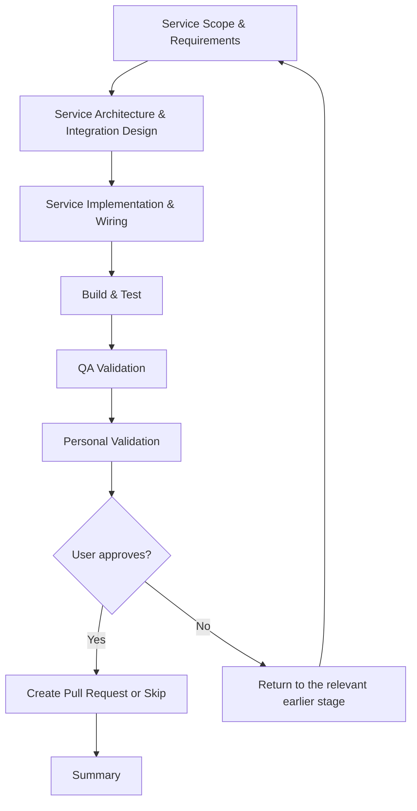
