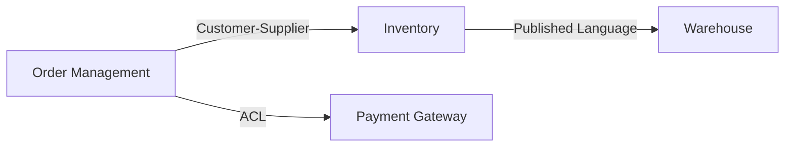

# Strategic Design Instructions

## Purpose

Guide bounded context discovery, subdomain identification, and context mapping decisions.

## Bounded Context Identification

Use these heuristics to identify bounded context boundaries:

1. **Language boundary.** When the same word means different things to different groups, a context boundary likely exists between them.
2. **Business capability boundary.** Each bounded context should align with a distinct business capability or subdomain.
3. **Team boundary.** Contexts should be ownable by a single team. If two teams need to change the same model independently, split the context.
4. **Data consistency boundary.** Data that must be immediately consistent belongs in the same context. Data that can be eventually consistent may span contexts.
5. **Change frequency boundary.** Parts of the domain that change at different rates are candidates for separate contexts.

## Context Boundary Validation

Before finalizing a bounded context, verify:

- [ ] The context has a single, clear purpose statement.
- [ ] The ubiquitous language within the context is consistent and unambiguous.
- [ ] No entity in this context requires direct access to another context's internal model.
- [ ] The context can be developed, deployed, and evolved independently.
- [ ] The context owner (team or individual) is identified.

## Context Mapping Patterns

Use these relationship patterns when mapping interactions between bounded contexts:

| Pattern | Description | Use when |
|---------|-------------|----------|
| Shared Kernel | Two contexts share a subset of the model. Changes require agreement from both teams. | Closely collaborating teams with a stable shared concept. |
| Customer-Supplier | Upstream context serves downstream context. Downstream needs influence upstream priorities. | Clear producer-consumer relationship with negotiation power. |
| Conformist | Downstream context adopts the upstream model as-is without translation. | Upstream has no incentive to accommodate downstream needs. |
| Anti-Corruption Layer | Downstream context translates the upstream model into its own language. | Protecting domain model integrity from external or legacy systems. |
| Open Host Service | Upstream context provides a well-defined protocol for integration. | Multiple downstream consumers need standardized access. |
| Published Language | A shared, well-documented language used for integration between contexts. | Industry standards or shared data formats are available. |
| Separate Ways | No integration between contexts. Each solves its own problem independently. | Integration cost exceeds benefit. |
| Partnership | Two contexts evolve together with mutual coordination. | Co-dependent features that must release together. |

## Context Map Diagram

Produce context maps using Mermaid flowchart syntax. Use labels on edges to indicate the relationship pattern.

Example structure:

## Subdomain Analysis

For each subdomain, document:

1. **Name** — aligned with ubiquitous language.
2. **Type** — core, supporting, or generic.
3. **Purpose** — one-sentence description of what this subdomain does for the business.
4. **Key domain concepts** — the most important entities, events, and rules.
5. **Bounded contexts** — which contexts implement this subdomain.
