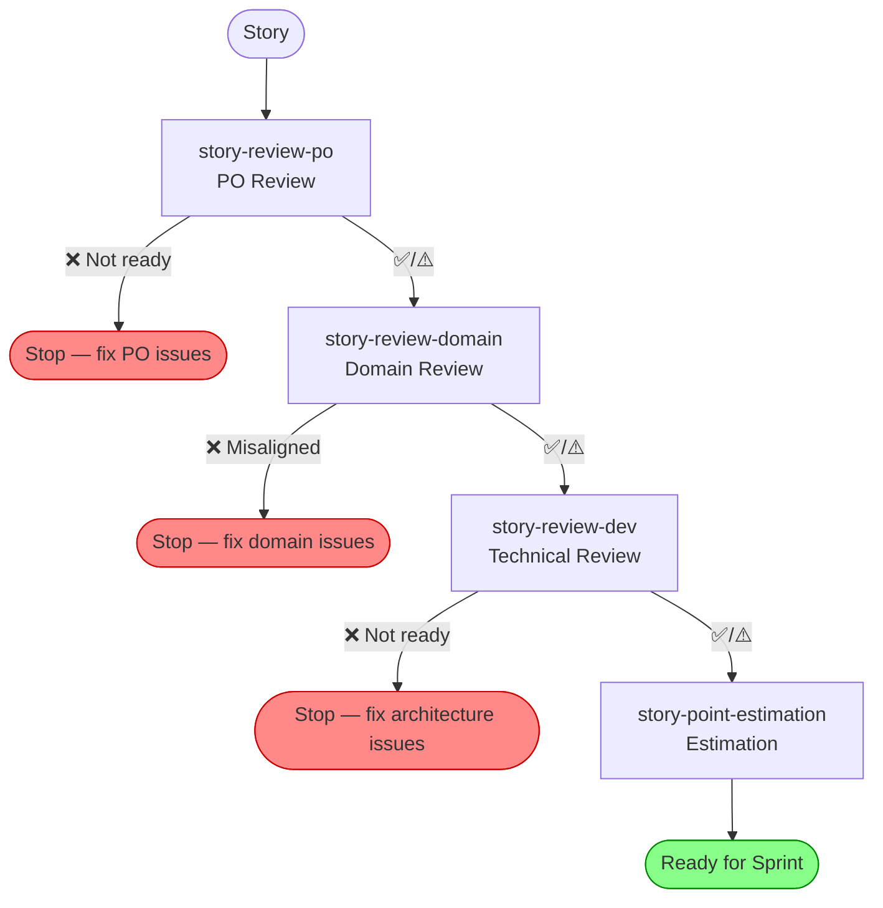
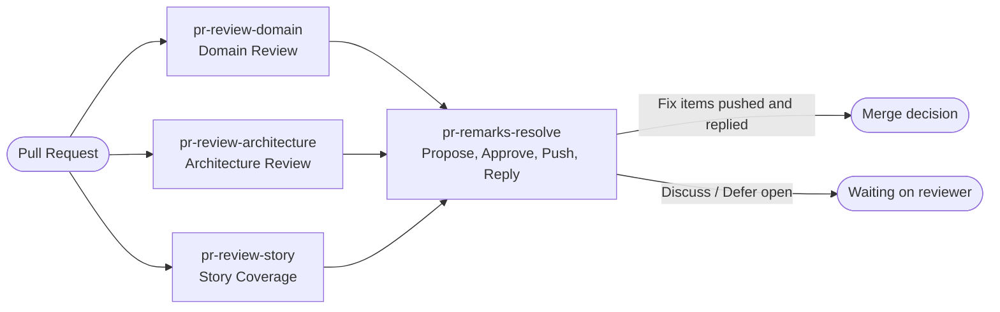

# fincent

Installable GitHub Copilot CLI plugin for Fincent project story review, dev,
domain alignment, PR review, and story point estimation workflows.

## Story Readiness Pipeline

Stories move through a sequential pipeline. Each step gates the next — a ❌ result
stops the pipeline and must be resolved before proceeding.



PR reviews run independently, parallel to the pipeline. `pr-review-story` verifies delivery
against the story; `pr-review-domain` and `pr-review-architecture` verify code quality.
`pr-remarks-resolve` closes the loop: it answers the remarks those reviews produce.



## Skills

### Core Skills (sequential pipeline)

| Skill | Gate | Purpose |
|-------|------|---------|
| `story-review-po` | — | Validate story format, DOR basics, title quality |
| `story-review-domain` | PO ✅/⚠️ | Ubiquitous language, aggregates, domain events |
| `story-review-dev` | PO ✅/⚠️ + Domain ✅/⚠️ | Technical review: fit, risks, enabler check |
| `story-point-estimation` | All three ✅/⚠️ | Three-factor Fibonacci estimate |

### PR Review Skills (independent)

| Skill | Purpose |
|-------|---------|
| `pr-review-architecture` | Layer boundaries, ADR compliance, NFRs, security |
| `pr-review-domain` | Domain layer purity, event naming, aggregate design |
| `pr-review-story` | Verify PR delivers all story acceptance criteria; flag out-of-scope changes |
| `pr-remarks-resolve` | Propose a solution per open review remark, get batch approval, push the changes, reply to every thread, resolve the fixed ones |

### Automation Skills (batch-by-Jira-status)

| Skill | Purpose |
|-------|---------|
| `automation-story-review-po` | Batch PO review across all stories in a status |
| `automation-story-review-dev` | Batch technical review with enabler drafting |
| `automation-story-review-domain` | Batch domain review with codebase inspection |
| `automation-story-point-estimation` | Batch estimation with drift reporting |

### Reporting & Presentation Skills

| Skill | Purpose |
|-------|---------|
| `sprint-report` | Sprint report: completed vs scope, untested, by epic |
| `automation-sprint-review` | End-to-end sprint review pipeline: sprint reports, release report, and PPTX demo deck |
| `release-report` | Release report: delivered vs scope, deferred, by epic, release notes draft |
| `demo-presentation` | Generate a Fincent Review demo presentation (PPTX structure) |

## Resources

- `resources/dor.md` — Fincent Definition of Ready (the shared readiness baseline)
- `resources/templates/story-review-checklist.md` — review and estimation checklist
- `resources/jira-setup.md` — shared Jira project configuration reference

## Scripts

- `scripts/FincentJira.psm1` — shared Jira primitives: authentication, paged search, field
  discovery, issue normalization, completion classification, ordering, totals, and dataset
  hashing. Both collection scripts import it, so the two reports cannot drift apart.
- `scripts/Get-SprintData.ps1` — deterministic sprint collection for `sprint-report`. Owns
  sprint resolution and emits a fixed-schema `sprint-data.json` for **one team**.
- `scripts/Get-ReleaseData.ps1` — deterministic release collection for `release-report`. Owns
  fixVersion resolution and emits a fixed-schema `release-data.json`.

Each dataset carries a `datasetHash` computed over its content excluding the generation
timestamp, so the same Jira state always produces the same hash and the same report.

```powershell
$env:JIRA_BASE_URL = 'https://innovadis.atlassian.net'
$env:JIRA_EMAIL    = 'you@innovadis.nl'
$env:JIRA_API_TOKEN = '<api token>'

./plugins/fincent/scripts/Get-ReleaseData.ps1 `
  -Release 'release/2026.32.0' `
  -OutputPath ./release-data.json

./plugins/fincent/scripts/Get-SprintData.ps1 `
  -Sprint 'Sprint A - Xanadu','Sprint B - Xanadu' `
  -Team 'Team B' `
  -ExpectedSprintCount 2 `
  -OutputPath ./sprint-data-team-b.json
```

## Dependencies

Story and PR review skills use a **discovered Jira skill**: the automation skills scan
installed skills at runtime for one that can retrieve, create, or update Jira issues.
No specific plugin name is required.

If no Jira skill is found, those automations fall back gracefully: ask the user to paste
story content and skip Jira write-back steps.

The sprint review pipeline is the exception — it does not use skill discovery. It reads Jira
exclusively through `scripts/Get-SprintData.ps1` and `scripts/Get-ReleaseData.ps1`, which need
`JIRA_BASE_URL`, `JIRA_EMAIL`, and `JIRA_API_TOKEN`.

## Install

```bash
copilot plugin install JSdotNet/Copilot:plugins/fincent
copilot plugin list
```

## Reinstall After Changes

```bash
copilot plugin install JSdotNet/Copilot:plugins/fincent
```

## Uninstall

```bash
copilot plugin uninstall fincent
```
