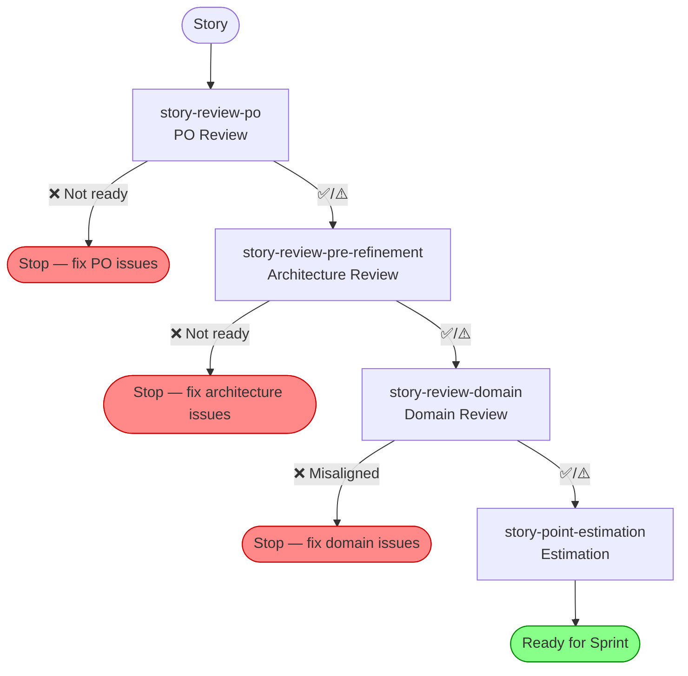
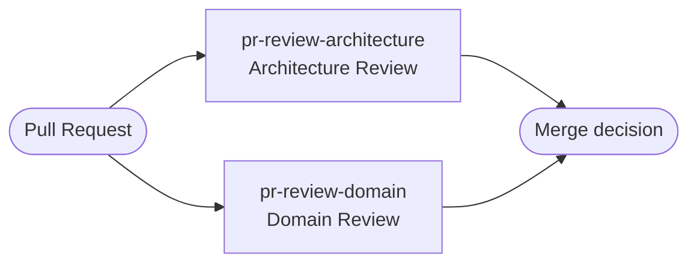

# fincent

Installable GitHub Copilot CLI plugin for Fincent project story review, pre-refinement,
domain alignment, PR review, and story point estimation workflows.

## Story Readiness Pipeline

Stories move through a sequential pipeline. Each step gates the next — a ❌ result
stops the pipeline and must be resolved before proceeding.



PR reviews run independently, parallel to the pipeline:



## Skills

### Core Skills (sequential pipeline)

| Skill | Gate | Purpose |
|-------|------|---------|
| `story-review-po` | — | Validate story format, DOR basics, title quality |
| `story-review-pre-refinement` | PO ✅/⚠️ | Architecture fit, risks, enabler check |
| `story-review-domain` | PO ✅/⚠️ + Arch ✅/⚠️ | Ubiquitous language, aggregates, domain events |
| `story-point-estimation` | All three ✅/⚠️ | Three-factor Fibonacci estimate |

### PR Review Skills (independent)

| Skill | Purpose |
|-------|---------|
| `pr-review-architecture` | Layer boundaries, ADR compliance, NFRs, security |
| `pr-review-domain` | Domain layer purity, event naming, aggregate design |

### Automation Skills (batch-by-Jira-status)

| Skill | Purpose |
|-------|---------|
| `automation-story-review-po` | Batch PO review across all stories in a status |
| `automation-story-review-pre-refinement` | Batch architecture review with enabler drafting |
| `automation-story-review-domain` | Batch domain review with codebase inspection |
| `automation-story-point-estimation` | Batch estimation with drift reporting |

## Resources

- `resources/dor.md` — Fincent Definition of Ready (the shared readiness baseline)
- `resources/templates/story-review-checklist.md` — review and estimation checklist

## Dependencies

All Jira interactions are handled by a **discovered Jira skill**. The automation skills
scan installed skills at runtime for one that can retrieve, create, or update Jira issues.
No specific plugin name is required.

If no Jira skill is found, automations fall back gracefully: ask the user to paste story
content and skip Jira write-back steps.

## Install

```bash
copilot plugin install JSdotNet/Copilot:plugins/fincent
copilot plugin list
```

## Reinstall After Changes

```bash
copilot plugin install JSdotNet/Copilot:plugins/fincent
```

## Uninstall

```bash
copilot plugin uninstall fincent
```
